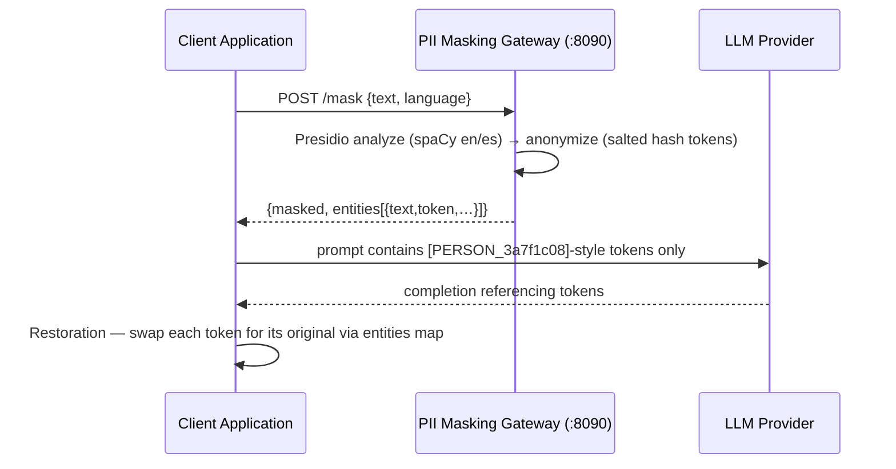

# Zero-Trust AI Perimeter — System Topology & Threat Model

The service exists to enforce one rule: **no payload reaches an LLM (or any
third party) without passing through `/mask` first.** The provider only ever
sees placeholder tokens; the ability to restore PII never leaves the
caller's boundary.

## End-to-end data flow

```
┌──────────────┐  1. raw text    ┌─────────────────┐  3. masked text  ┌─────────────┐
│   Client     │ ───────────────▶│  PII Masking    │ ───────────────▶ │ LLM Provider│
│ Application  │                 │  Gateway        │                  │ (cloud/local)│
│              │◀────────────────│  FastAPI :8090  │◀──────────────── │             │
└─────┬────────┘  2. masked +    └────────┬────────┘  4. completion   └─────────────┘
      │             entities map          │                with tokens
      │           (caller retains)        │
      │  5. Restoration: replace each      │  Infisical (runtime)
      │     token with its original        │  PII_MASTER_KEY / PII_HASH_SALT /
      ▼                                    ▔▶ PII_API_TOKEN injected at boot
   restored PII
```



Steps:

1. Client sends raw text to `POST /mask` (with `X-API-Key` when enforced).
2. Gateway returns `masked` plus the `entities` map; the client retains the
   map (this is the reverse-desanonymization dictionary — the service keeps
   no PII↔token state).
3. Masked text is sent to the LLM. Tokens are stable across requests given a
   stable `PII_HASH_SALT`, so coreference survives.
4. The LLM completion references the same tokens.
5. The client performs Restoration locally by replacing each token with its
   original value from the map.

## Secret injection path (Infisical)

No unencrypted `.env` inside the container. `entrypoint.sh` runs before
uvicorn:

1. **Universal Auth** — `POST /api/v1/auth/universal-auth/login` with
   `INFISICAL_CLIENT_ID` / `INFISICAL_CLIENT_SECRET` (injected by compose,
   which itself reads them from the host environment) → access token.
2. **Fetch** — `GET /api/v3/secrets/raw?workspaceId=<project>&environment=<env>`
   returns every secret in the project.
3. **Export** — each `secretKey=secretValue` pair is shell-quoted and
   exported into the process environment, then `exec uvicorn`.
4. The app reads `PII_MASTER_KEY`, `PII_HASH_SALT`, `PII_API_TOKEN` from the
   environment; nothing is written to disk.

Without Infisical credentials the entrypoint falls back to plain env vars
(and auto-generates the master key + a warning for a missing salt).
Operational detail: [Infisical runbook](../runbooks/infisical-integration.md).

## Threat model (abridged)

| Threat | Mitigation |
|---|---|
| LLM provider logs the prompt | Prompt contains only salted tokens; raw PII never egresses |
| Token brute-force (low-entropy names/emails) | `PII_HASH_SALT` is a **secret** (ADR 0001); offline dictionary attacks must guess it |
| Token collision (two values share a token) | 8-hex digest = 32 bits; collision risk grows past ~10⁴–10⁵ distinct values per label. Namespaced by label prefix. Acceptable at current volume; widen `TOKEN_HASH_HEX_LEN` if scale demands |
| Unauthorized `/mask` use | `REQUIRE_API_KEY=true` + hashed-at-rest API tokens; raw shown once |
| Admin surface takeover | `X-Master-Key` constant-time compare; auto-generated key if unset |
| Secrets at rest on host | Infisical injection; only machine-identity credentials touch the host |
| Container escape / lateral | Non-root uid 1001, `no-new-privileges:true`, internal network only, no public ingress |
| Service becomes a PII honeypot | No PII↔token store exists server-side; nothing to exfiltrate but the salt |

## Trust boundaries

- **Client → Gateway:** text is *trusted* input; auth optional
  (`REQUIRE_API_KEY`) for internal deployments, required for multi-tenant.
- **Gateway → LLM:** masked only. This boundary is the entire point.
- **Gateway ↔ Infisical:** machine identity over the `infisical` docker
  network (external compose network `infisical_infisical`).
